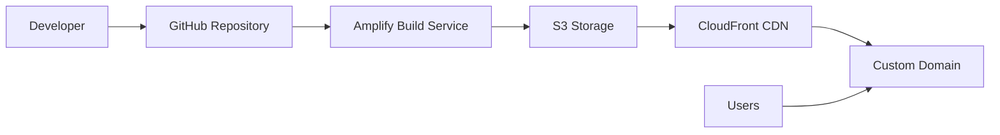

# Design Document: AWS Amplify Deployment Setup

## Overview

This design outlines the implementation of AWS Amplify hosting for a React + Vite application with automatic GitHub integration. The solution provides continuous deployment, custom domain support, and comprehensive monitoring capabilities.

## Architecture

The deployment architecture consists of three main components:

1. **Source Control Integration**: GitHub repository connected via OAuth
2. **Build Pipeline**: AWS Amplify build service with custom build specification
3. **Hosting Infrastructure**: AWS CloudFront CDN with S3 backend storage



## Components and Interfaces

### GitHub Integration Component

**Purpose**: Manages the connection between GitHub repository and Amplify service

**Key Functions**:
- OAuth authentication with GitHub
- Webhook configuration for push events
- Repository and branch selection
- Commit tracking and metadata extraction

**Configuration**:
- Repository URL and access permissions
- Target branch for deployment (typically `main` or `master`)
- Build trigger conditions (push to branch, pull request, etc.)

### Build Pipeline Component

**Purpose**: Handles the build process from source code to deployable assets

**Build Phases**:
1. **Provision**: Set up build environment with specified Node.js version
2. **Pre-build**: Install dependencies using `npm install`
3. **Build**: Execute `npm run build` to create production assets
4. **Post-build**: Optional post-processing and optimization
5. **Deploy**: Upload assets to S3 and invalidate CloudFront cache

**Build Specification Structure**:
```yaml
version: 1
frontend:
  phases:
    preBuild:
      commands:
        - npm ci
    build:
      commands:
        - npm run build
  artifacts:
    baseDirectory: dist
    files:
      - '**/*'
  cache:
    paths:
      - node_modules/**/*
```

### Hosting Infrastructure Component

**Purpose**: Serves the built application to end users with high availability and performance

**Components**:
- **S3 Bucket**: Stores static assets (HTML, CSS, JS, images)
- **CloudFront Distribution**: Global CDN for fast content delivery
- **Route 53**: DNS management for custom domains
- **Certificate Manager**: SSL/TLS certificate provisioning

## Data Models

### Application Configuration
```typescript
interface AmplifyApp {
  appId: string;
  name: string;
  repository: GitHubRepository;
  defaultDomain: string;
  customDomains: CustomDomain[];
  environmentVariables: EnvironmentVariable[];
  buildSettings: BuildSettings;
}

interface GitHubRepository {
  owner: string;
  name: string;
  branch: string;
  accessToken: string;
}

interface BuildSettings {
  buildSpec: string;
  nodeVersion: string;
  environmentType: 'PRODUCTION' | 'DEVELOPMENT';
}

interface CustomDomain {
  domainName: string;
  certificateArn: string;
  domainStatus: 'PENDING' | 'AVAILABLE' | 'FAILED';
}
```

### Build Execution
```typescript
interface BuildExecution {
  buildId: string;
  status: 'PENDING' | 'RUNNING' | 'SUCCEED' | 'FAILED';
  startTime: Date;
  endTime?: Date;
  commitId: string;
  commitMessage: string;
  buildLogs: BuildLog[];
}

interface BuildLog {
  timestamp: Date;
  message: string;
  level: 'INFO' | 'WARN' | 'ERROR';
}
```

## Correctness Properties

*A property is a characteristic or behavior that should hold true across all valid executions of a system-essentially, a formal statement about what the system should do. Properties serve as the bridge between human-readable specifications and machine-verifiable correctness guarantees.*

Since this feature involves configuring AWS Amplify through the AWS Console (a third-party service), most acceptance criteria are examples of specific configuration steps rather than universal properties that can be tested programmatically. The correctness of this implementation will be validated through:

1. **Configuration Verification Examples**: Specific test cases that verify each configuration step works as expected
2. **Integration Testing**: End-to-end tests that verify the complete deployment pipeline
3. **Manual Validation**: Verification that the AWS Console displays expected information and behaves correctly

**Example Test Cases**:

- Verify GitHub authentication allows repository selection
- Verify build specification produces correct output directory structure
- Verify successful builds trigger automatic deployment
- Verify custom domain configuration generates SSL certificates
- Verify environment variables are available during build process

## Error Handling

### Build Failures
- **Dependency Installation Errors**: Clear error messages when npm install fails
- **Build Command Failures**: Detailed logs showing which build step failed
- **Asset Upload Errors**: Retry mechanisms for S3 upload failures
- **Cache Invalidation Errors**: Fallback mechanisms when CloudFront invalidation fails

### GitHub Integration Errors
- **Authentication Failures**: Clear instructions for re-authentication
- **Webhook Configuration Errors**: Automatic retry with exponential backoff
- **Repository Access Errors**: Detailed permissions error messages

### Domain Configuration Errors
- **DNS Validation Failures**: Step-by-step troubleshooting guide
- **Certificate Generation Errors**: Automatic retry with status updates
- **Domain Ownership Validation**: Clear instructions for domain verification

## Testing Strategy

### Manual Configuration Testing
Since this feature primarily involves AWS Console configuration, testing will focus on:

1. **Step-by-Step Validation**: Verify each configuration step produces expected results
2. **Integration Testing**: Test the complete flow from GitHub push to live deployment
3. **Error Scenario Testing**: Verify error handling and recovery mechanisms
4. **Performance Testing**: Measure build times and deployment speed

### Automated Validation Scripts
Create scripts to validate:
- Build specification syntax and compatibility
- Environment variable configuration
- Domain DNS configuration
- SSL certificate status

### Documentation Testing
- Verify all setup instructions are accurate and complete
- Test instructions with fresh AWS accounts
- Validate troubleshooting guides with common error scenarios

<function_calls>
<invoke name="prework">
<parameter name="featureName">amplify-deployment